# Working with the deployment

> After we acombished the [```Deployment Steps```](README.md) We are ready to see how 
> to integrate it in ```Visual Studio Code``` now and work with all the parts of the deployment.

- Visual Studio Code
    - [Starting: Visual Studio Code](#Starting-Visual-Studio-Code)
        - [Open a new VSC Window with the WSL Distribution](#Open-a-new-VSC-Window-with-the-WSL-Distribution)
        - [Select siteconnect-ubuntu-18.04 Distribution](#Select-siteconnect-ubuntu-18-04-Distribution)
        - [Adding helpful Extentions to Visual Studio Code](#Adding-helpful-Extentions-to-Visual-Studio-Code)
        - [Open a folder (/home/siteconnect) in the Remote Session](#Open-a-folder-homesiteconnect-in-the-Remote-Session)
    - [Full Integration View of WSL in Visual Studio Code](#Full-Integration-View-of-WSL-in-Visual-Studio-Code)

- Terminal
    - [Starting: WSL Distribution (Terminal) in parallel](#Starting-WSL-Distribution-Terminal-in-parallel)
        -[Example: Clone a DevOps Repository](#Example-Clone-a-DevOps-Repository)

- Docker Desktop
    - ```COMMING SOON```

# Starting: Visual Studio Code

Simply start ```Visual Studio Code``` on your Computer.

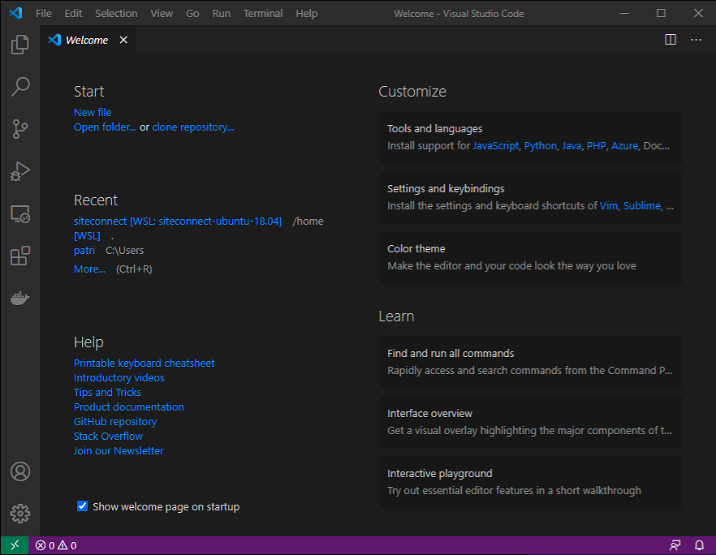

> **COMMENT:** You maybe will get a message, that ```Visual Studio Code``` realized
> ```WSL``` installed on your computer during the start. It will ask you to intall the integration.
> You need to say ```OK``` if this shows up to go ahed with installing this integration.
> This happens usualy during the first starto of ```Visual Studio Code``` after **WSL** got installed
> Allowing to install this integration is essential for all following steps to have this installed.

[BACK](#Working-with-the-deployment)

## Open a new VSC Window with the WSL Distribution

After you opend ```Visual Studio Code``` you might already realized the new green button
in the left down corner of you ```Visual Studio Code``` window. This is you starting point
of accessing/attaching your ```WSL``` Distribution to ```Visual Studio Code```.

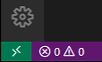

Simply chlick on it and you will get the posibilty to start a new ```Visual Studio Code```
Window into the ```WSL``` Distribution:

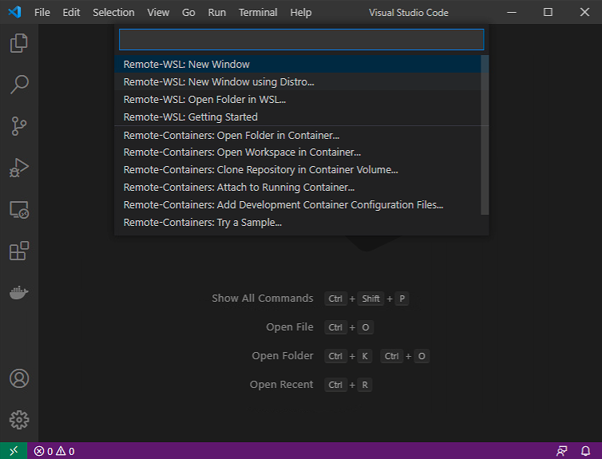

Select ```Remote-WSL: New Window using Distrio...``` to go ahead.

[BACK](#Working-with-the-deployment)

## Select siteconnect-ubuntu-18.04 Distribution

Now, selet your created ```siteconnect-ubuntu-18.04``` and open it.

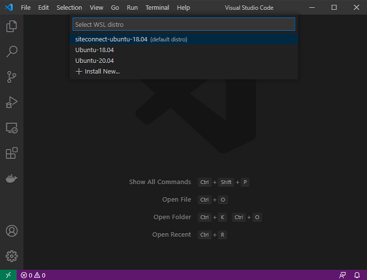

If the connection process ran successfully, you will realize, the
statusbar of ```Visual Studio Code``` has changed again. It shows
you the connection in the down left corner, like this:


You successfully conned to the ```WSL``` Distribution.

[BACK](#Working-with-the-deployment)

## Adding helpful Extentions to Visual Studio Code

Making our life easy, it is helpfull to install some ```Visual Studio Code```
Extentions to the Remote Connection. This is mainely to help us by
dealing with ```WSL```, ```Docker```, and ```Postgress```.
Feel also free to install the Extentions you need. Take care that you
install it into the ```Remote-Session``` and not local.

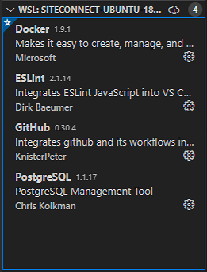

[BACK](#Working-with-the-deployment)

## Open a folder (/home/siteconnect) in the Remote Session

let's open the **siteconnect's** user home directory into the ```Visual Studio Code```
session. You can simpy check the: ```Add Folder``` button:

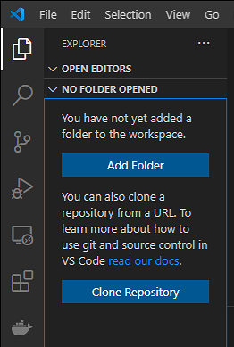

Select the folder you want to open. Default is set to the **siteconnect's**
home folder. I highly recomment, you use this folder as root of all
your actions. It makes it easy to point scripts and application configs
to the home folder:

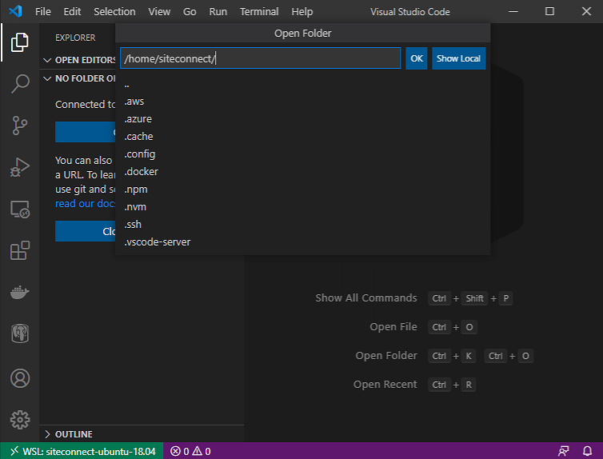

[BACK](#Working-with-the-deployment)

## Full Integration View of WSL in Visual Studio Code

Now you should get a simular ```Visual Studio Code``` Windows as shown here:

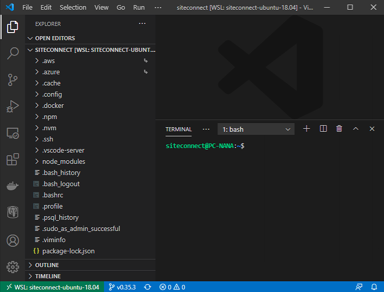

**You will see:**
- The folder you opend (/home/siteconnect) with all the conetent. 
- A ```Terminal``` section that points to the **siteconnect's** home directory.
- All installed integration in the Icon Bar on the left.
- The succesfull conected WSL Distribution (green in the Status Bar).

This was the final step on ```Visual Studio Code```.

[BACK](#Working-with-the-deployment)

# Starting: WSL Distribution (Terminal) in parallel

Even you can not share a login session, you are able to open another session to your
WSL Distribution and do customizations that appears in all open sessions. Use the installed
```Terminal``` Application from the Micorosft Store to make our life easy, and handling
the different Distributions we might have.

Open the ```Terminal``` Aplication and select the ```siteconnect-ubuntu-18.04``` 
Distibution, as shown here:

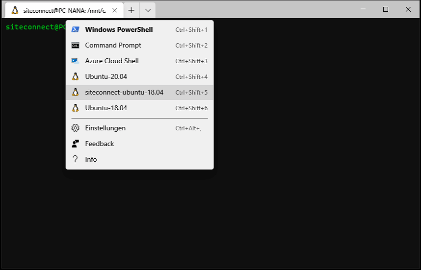

[BACK](#Working-with-the-deployment)

## Example: Clone a DevOps Repository

Get the public part of you SSH key:

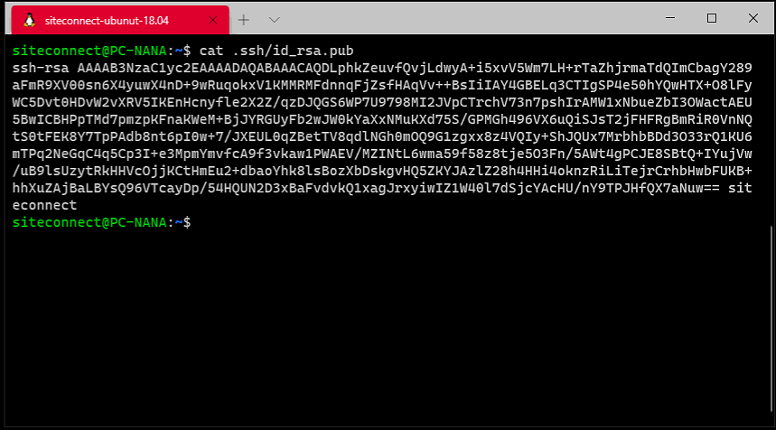

Add the public part of the SSH key to you DevOps user:

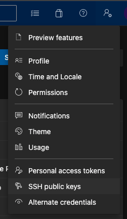

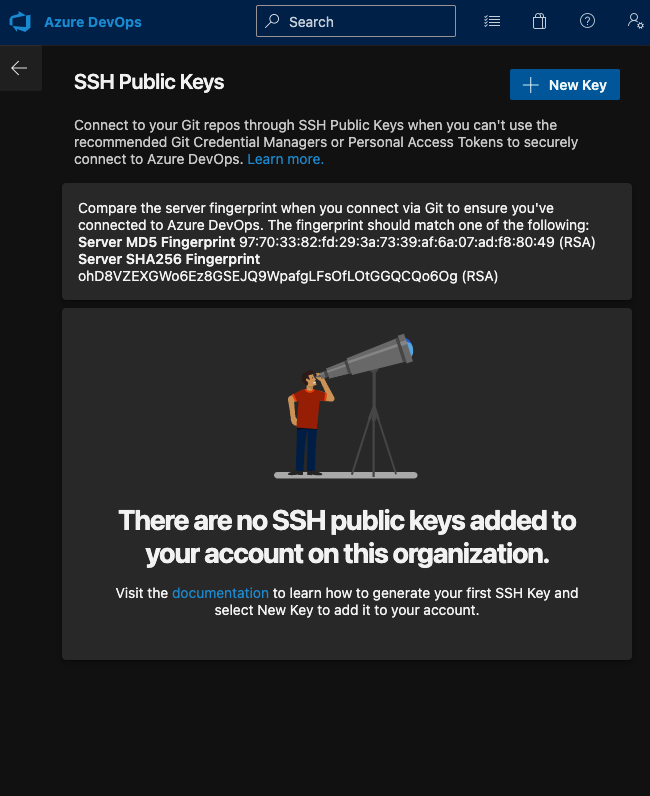

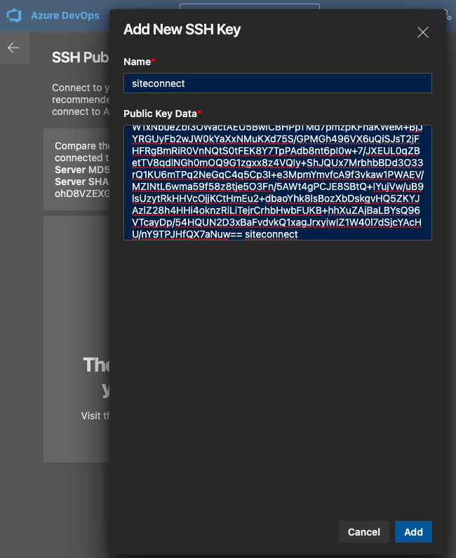

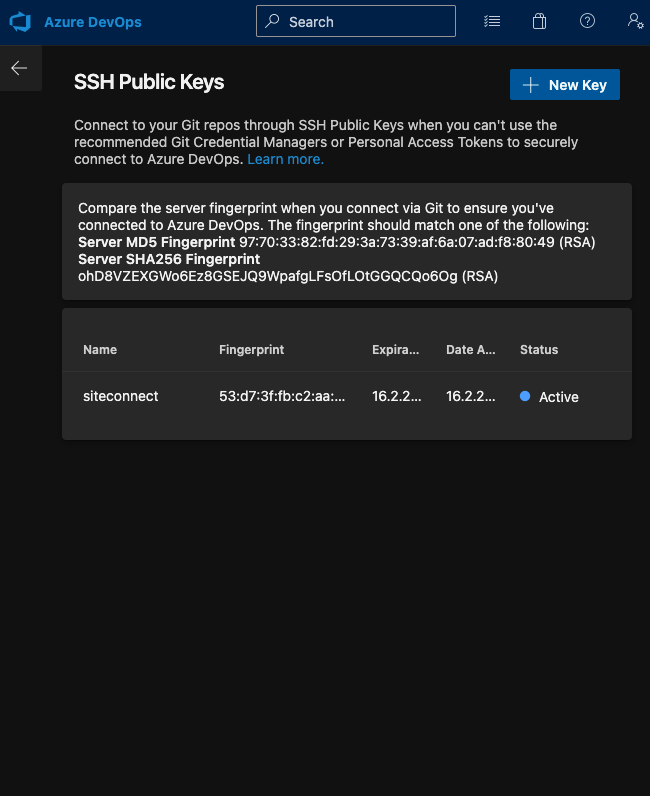

Open you DevOps Project and select the Repository you want clone
and select the ```CLONE``` Button:

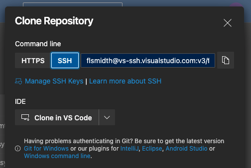

You need to change the ```Command Line``` form ```HTTPS``` to ```SSH```

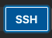

Copy the SSH path:


You are now ready to clone the Repository.
Let's go back to the ```WSL``` Command Line and
Clone the Repository:

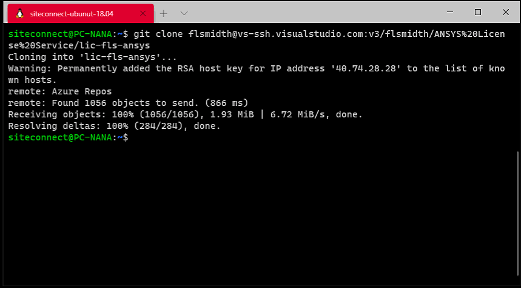

After the Replository finished the download, you
will find the Repository in your home folder.
Check it by listing the directory:

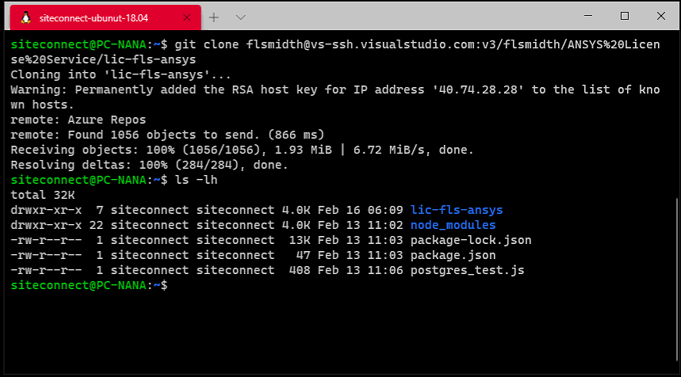

If you go to you ```Visual Studio Code``` Window,
you can list the direcoty in the Terminal and find
the folder here as well:

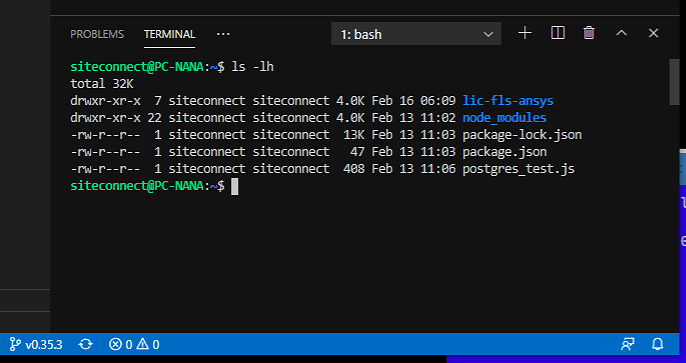

COMMENT: As I said at the beginning, you always share
the Distribution in all referended sessions. Any change
you do will be aviable right away in all connected sessions.