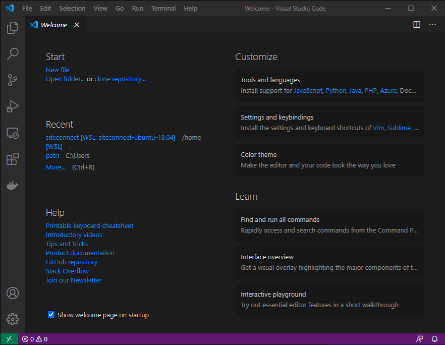
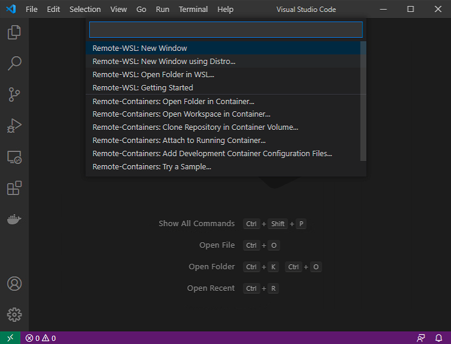
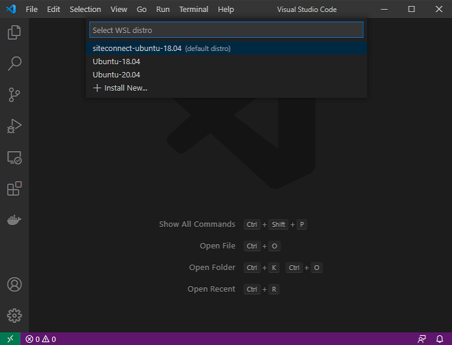
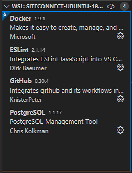
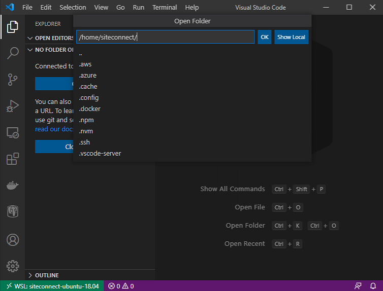
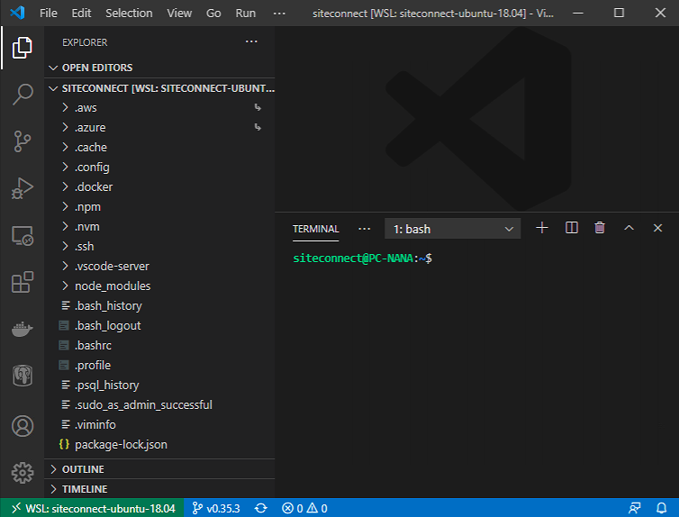
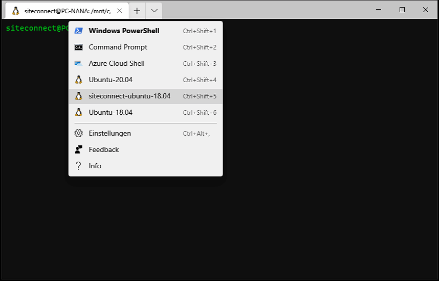

# Working with the deployment

# Starting: Visual Studio Code

Simply start ```Visual Studio Code``` on your Computer.

<p float="left">
  
</p>

<p float="left" width="640">
  You maybe will get a message, Visual Studio Code realized
  WSL installed on your computer and will ask you to intall the integration.
  You need to say <b>OK</b>to go ahed with installing this integration.
  This is essential for all following steps to have this installed.
</p>

> **COMMENT:** You maybe will get a message, Visual Studio Code realized
> WSL installed on your computer and will ask you to intall the integration.
> You need to say ```OK``` to go ahed with installing this integration.
> This is essential for all following steps to have this installed.

[BACK](#Working-with-the-deployment)

## Green Button

<p float="left">
  
</p>

<p float="left">
  
</p>

## Select Distribution
<p float="left">
  
</p>

## Status Bar connection message

<p float="left">
  
</p>

## Adding Extentions to VSC

<p float="left">
  
</p>

## Open a folder (/home/siteconnect)

<p float="left">
  
</p>

## After starting VSC with installed VSC extentions

<p float="left">
  
</p>

# Starting: WSL Distribution in Terminal in parallel

<p float="left">
  
</p>