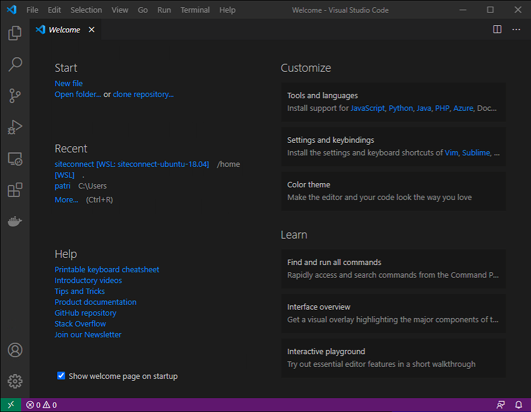
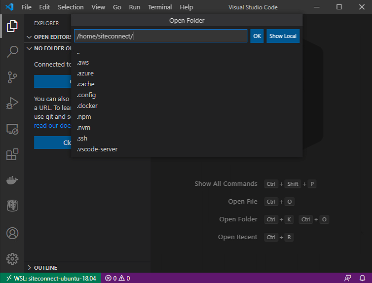

# Working with the deployment

> After we accomplished the [```Deployment Steps```](INSTALL.md), We are ready to see how 
> to integrate it in ```Visual Studio Code``` now and work with all the parts of the deployment.

- Visual Studio Code
    - [Starting: Visual Studio Code](#Starting-Visual-Studio-Code)
    - [Open a new VSC Window with the WSL Distribution](#Open-a-new-VSC-Window-with-the-WSL-Distribution)
    - [Select siteconnect-ubuntu-18.04 Distribution](#Select-siteconnect-ubuntu-18-04-Distribution)
    - [Adding helpful Extentions to Visual Studio Code](#Adding-helpful-Extentions-to-Visual-Studio-Code)
    - [Open a folder (/home/siteconnect) in the Remote Session](#Open-a-folder-homesiteconnect-in-the-Remote-Session)
    - [Full Integration View of WSL in Visual Studio Code](#Full-Integration-View-of-WSL-in-Visual-Studio-Code)

- Terminal
    - [Starting: WSL Distribution (Terminal) in parallel](#Starting-WSL-Distribution-Terminal-in-parallel)
    - [Example: Clone a DevOps Repository](#Example-Clone-a-DevOps-Repository)

- Docker Desktop
    - ```COMING SOON```

[BACK TO THE ```README```](README.md)

# Starting: Visual Studio Code

Start ```Visual Studio Code``` on your Computer.



> **COMMENT:** You maybe will get a message that ```Visual Studio Code``` realized
> ```WSL``` installed on your computer during the start. It will ask you to install the integration.
> You need to say ```OK``` if this shows up to go ahead with installing this integration.
> This usually happens during the first start of ```Visual Studio Code``` after **WSL** got installed
> Allowing to install this integration is essential for all following steps to have this installed.

[BACK](#Working-with-the-deployment)

## Open a new VSC Window with the WSL Distribution

After you opened ```Visual Studio Code``` you might already realize the new green button
in the left down corner of your ```Visual Studio Code``` window. It is your starting point
of accessing/attaching your ```WSL``` Distribution to ```Visual Studio Code```.


Click on it, and you will get the possibility to start a new ```Visual Studio Code```
Window into the ```WSL``` Distribution:


Select ```Remote-WSL: New Window using Distrito...``` to go ahead.

[BACK](#Working-with-the-deployment)

## Select siteconnect-ubuntu-18.04 Distribution

Now, select your created ```siteconnect-ubuntu-18.04``` and open it.


If the connection process ran successfully, you would realize, the
status bar of ```Visual Studio Code``` has changed again. It shows
you the connection in the down, left corner, like this:


You successfully conned to the ```WSL``` Distribution.

[BACK](#Working-with-the-deployment)

## Adding helpful Extensions to Visual Studio Code

Making our life easy, it is helpful to install some ```Visual Studio Code```
Extensions to the Remote Connection. It is mainly to help us by
dealing with ```WSL```, ```Docker```, and ```Postgress```.
Feel also free to install the Extensions you need. Take care that you.
Install it into the ```Remote-Session``` and not local.


[BACK](#Working-with-the-deployment)

## Open a folder (/home/siteconnect) in the Remote Session

let's open the **siteconnect's** user home directory into the ```Visual Studio Code```
session. You can check the: ```Add Folder``` button:


Select the folder you want to open. Default is set to the **site connect**
home folder. I highly recommend you use this folder as the root of all
your actions. It makes it easy to point scripts and application configs
to the home folder:



[BACK](#Working-with-the-deployment)

## Full Integration View of WSL in Visual Studio Code

Now you should get a similar ```Visual Studio Code``` Windows as shown here:


**You will see:**
- The folder you opened (/home/siteconnect) with all the content. 
- A ```Terminal``` section that points to the **siteconnect's** home directory.
- All installed integration in the Icon Bar on the left.
- The successful connected WSL Distribution (green in the Status Bar).

It was the final step on ```Visual Studio Code```.

[BACK](#Working-with-the-deployment)

# Starting: WSL Distribution (Terminal) in parallel

Even you can not share a login session. You can open another session to your
WSL Distribution and do customizations that appears in all open sessions. Use the installed
```Terminal``` Application from the Microsoft Store to make our life easy and handling
the different Distributions we might have.

Open the ```Terminal``` Application and select the ```siteconnect-ubuntu-18.04``` 
Distribution, as shown here:


[BACK](#Working-with-the-deployment)

## Example: Clone a DevOps Repository

In this example, I will show you how easy it is to clone a 
DevOps Repository into the ```WSL``` Distribution. 

**Requirements:**
- A valid SSH key, aviable as: ~/.ssh/id_rsa
    - [Generate SSH Key](INSTALL.md#Generate-SSH-Key)

- GIT needs to be installed as well (yum):
    - [Preparing WSL Ubuntu 18.04 LTS](INSTALL.md#Preparing-WSL-Ubuntu-1804-LTS)

Getting the public key, use a simple ```cat``` command:

```bash
$ cat ~/.ssh/id_rsa.pub
```


Copy the output in your ```Clipboard``` (STRG-C). We need it to add the Key
to your DevOps user Account later. 

Follow the steps in the Microsoft document to add the SSH key and clone the Repository.

[Use SSH key authentication](https://docs.microsoft.com/en-us/azure/devops/repos/git/use-ssh-keys-to-authenticate?view=azure-devops)

After the Repository finished the download, you
will find the Repository in your home folder.
Check it by listing the directory: ```FLS-MyPlantv2-Backend-Latest```

Use your own credentilas to Clone: [```FLS-MyPlantv2-Backend-Latest```](https://dev.azure.com/FLS-GD-RnD/Fls.SiteConnect/_git/FLS-MyPlantv2-Backend-Latest) from Azure DevOps.


If you go to your ```Visual Studio Code``` Window,
you can list the directory in the Terminal and find
the folder here as well:


> **COMMENT:** As I said initially, you always share
> the Distribution in all referenced sessions. Any change
> you do will be available right away in all connected sessions.

[BACK](#Working-with-the-deployment)

